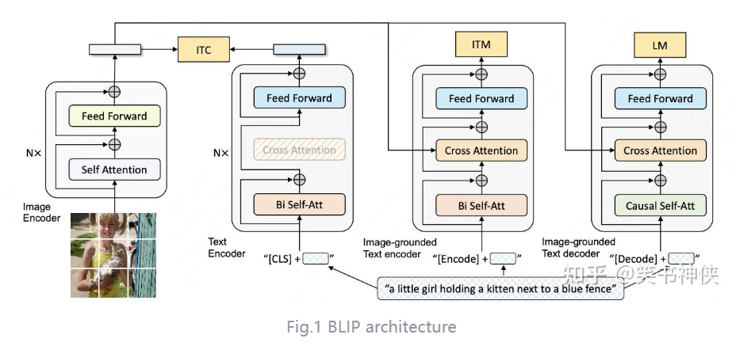
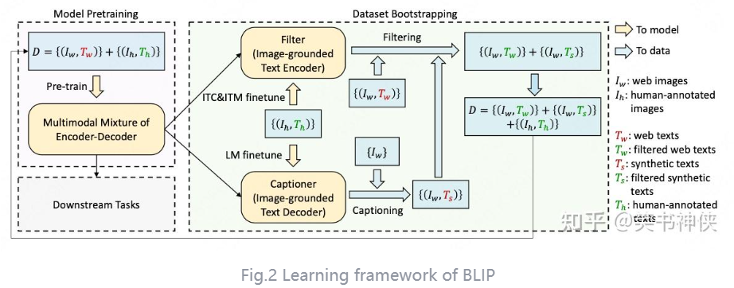
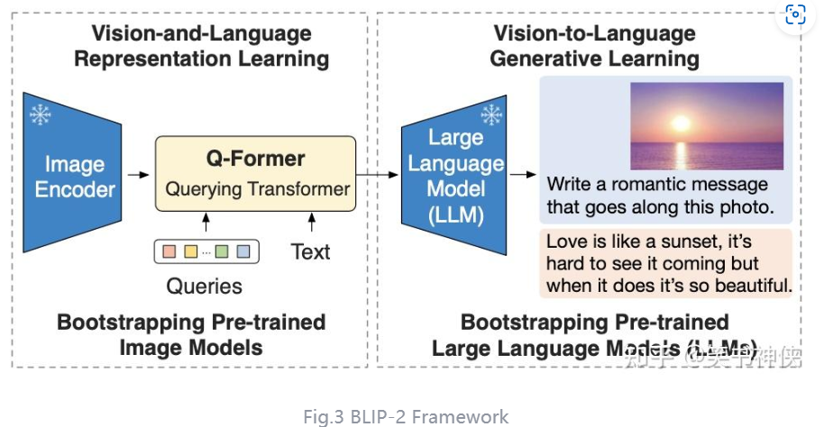
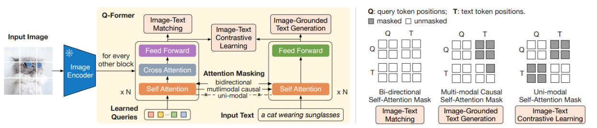

### Blip和Blip2的区别

blip采用编码器-解码器的多模态混合结构，有一个图像编码器、文本编码器、一个以图像为基础的编码器、一个以图像为基础的解码器。通过3个损失函数训练。ITC:图文对比损失，ITM：图文匹配损失，LM：语言建模损失。其中ITC通过将图像编码器与文本编码器进行对比学习，对齐图像文本的特征空间。ITM是针对以图像为基础的编码器，针对图文匹配问题进行二分类。LM是针对以图像为基础的解码器，生成caption。为了解决VIT存在的数据噪声问题，blip提出了一种数据清洗的策略。由captioner生成caption，由filter对数据进行匹配，过滤掉噪声数据。所以blip会先用带噪声数据训练一遍模型，然后用强监督数据微调captioner和filter，利用captioner和filter对数据进行清洗，从而得到一个新的强监督数据集，重新训练一遍模型。

blip2通过使用预训练的视觉模型、语言模型来降低学习成本。blip2由一个预训练的图像编码器、可学习的Q-Former、预训练的大语言模型组成。Q-Former采取俩阶段的训练策略。第一阶段是表示学习，ITC，使用各自的注意力掩码进行对比学习；ITM使用双向注意力机制掩码实现QT之间的交互。ITG使用单向注意力机制，Q不能看见T，T可以看见Q以及前面的T。
第二阶段为生成式学习。通过将Q-Former学习到的向量输入一个线性层传递给LLM。
